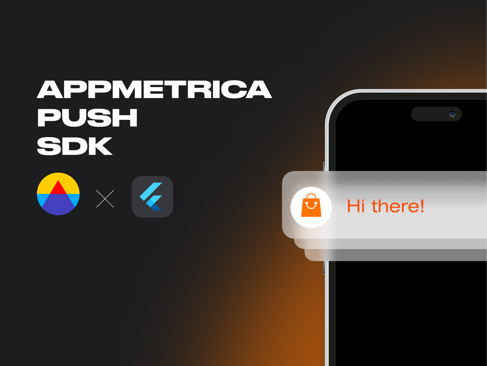

</a>

<h1 align="left">Flutter AppMetrica Push</h1>

[AppMetrica Push][appmetrica_push] SDK — это набор библиотек для работы с push-уведомлениями. Подключив AppMetrica Push SDK, вы можете создать и настроить кампанию push-уведомлений, а затем отслеживать статистику в веб-интерфейсе AppMetrica.

[Документация по SDK][appmetrica_documentation].

<h4> Мы создаем мобильные приложения и корпоративные сервисы, реализуем сложные IT-проекты для крупного и среднего бизнеса.</h4>

<h5>Подпишитесь на обновления:</h5>

 

## Возможности SDK

- получение и отображение Push уведомлений
- получение Silent Push уведомлений
- обработка payload из уведомлений
- отображение изображения в уведомлениях
- поддержка действия deeplink, при открытии уведомления
- поддержка действия URL, при открытии уведомления

## Platform Support
| Android | iOS | Huawei |
|:---:|:---:|:---:|
| FCM | APNs | HMS |

## Packages
|  |  |
|:---:|:---:|
| appmetrica_push |  |
| appmetrica_push_android |  |
| appmetrica_push_huawei |  |
| appmetrica_push_ios |  |
| appmetrica_push_platform_interface |  |

## Пример работы

Пример работы SDK доступен в [Example iOS & Android][example_fcm]

Пример работы SDK доступен в [Example Huawei][example_hms]

[appmetrica_push]: https://appmetrica.yandex.ru/about/push-campaigns
[appmetrica_documentation]: https://appmetrica.yandex.ru/docs/mobile-sdk-dg/push/push-about.html
[example_hms]: https://github.com/MadBrains/AppMetrica-Push-Flutter/tree/main/examples/example_hms
[example_fcm]: https://github.com/MadBrains/AppMetrica-Push-Flutter/tree/main/examples/example_fcm
